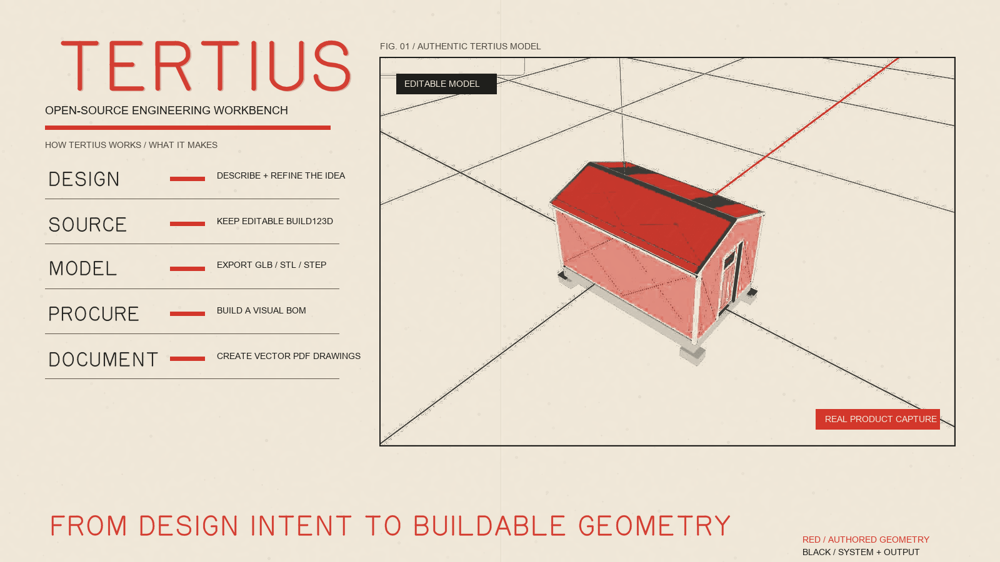
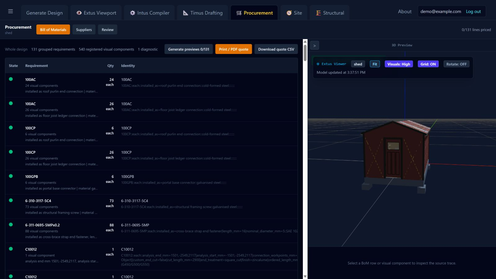
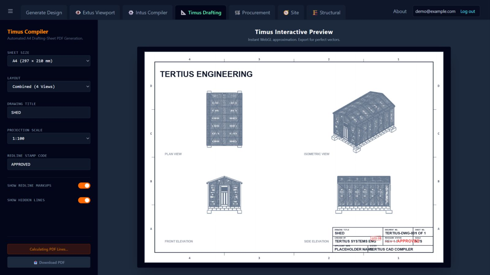

<div align="center">
  

  # Tertius

  **An open-source engineering workbench for turning design intent into editable CAD models, procurement data, and technical drawings.**

  [Capabilities](#capabilities) · [Workflows](#workflows) · [Getting started](#getting-started) · [Architecture](#architecture) · [Development](#development)
</div>

> [!IMPORTANT]
> Tertius is under active development. Interfaces, artifact formats, and deployment details may change between releases.

Tertius combines conversational design, Python-based parametric modelling, asynchronous CAD compilation, 3D inspection, visual bills of materials, supplier quote exports, and drawing generation in one browser-based workspace. Build123D source remains editable throughout the workflow rather than being hidden behind a generated model.

## Watch Tertius in action

<table>
  <tr>
    <td align="center"><a href="https://youtu.be/_rCYJJal89w"></a><br /><strong>Design a garden shed with AI</strong></td>
    <td align="center"><a href="https://youtu.be/XHYL_hoQHuY"></a><br /><strong>Add windows and doors with AI</strong></td>
    <td align="center"><a href="https://youtu.be/mIWmUKyoQxY"></a><br /><strong>Turn an idea into a 3D part</strong></td>
  </tr>
</table>

## Capabilities

- **Design with context:** create and refine a project through a persistent Generate Design conversation.
- **Keep the source:** inspect and edit the Build123D project files and semantic feature tree behind the model.
- **Compile real CAD artifacts:** produce GLB, STL, and STEP outputs through isolated asynchronous compile jobs.
- **Inspect the result:** view authored colours, transparent materials, assemblies, and selected components in the shared Extus viewport.
- **Prepare procurement data:** derive a visual-first bill of materials, inspect component provenance, and export supplier quote packages.
- **Produce drawings:** generate vector PDF drawing sheets from compiled geometry with Timus.

## Workflows

| Surface | Role in the workbench |
| --- | --- |
| **Generate Design** | Conversational design and multi-file AI editing with project history and compiled-model previews. |
| **Artus** | Semantic feature, parameter, and geometric-operation inspection linked to the current project. |
| **Intus** | Project source editing, version history, asynchronous compilation, and GLB/STL/STEP export. |
| **Extus** | Shared real-time 3D inspection for generated designs, compiled artifacts, and procurement selections. |
| **Procurement** | Visual-first BoM analysis, component review, supplier quote preparation, and quote export. |
| **Timus** | Technical drawing-sheet generation and vector PDF export. |

The normal product flow is:

```text
Design conversation → editable Build123D source → compile → inspect → procure or document
```

## Product views

All imagery below is captured from real Tertius sessions and real compiled artifacts—no generated UI or synthetic CAD artwork. The [`assets/README.md`](assets/README.md) contribution brief defines how future authenticated captures should be staged.

| Visual bill of materials | Technical drawing output |
| :---: | :---: |
|  |  |

## Getting started

### Requirements

- Docker with Compose
- Node.js 20+ for running the frontend outside Compose
- `uv` for running Python tooling outside Compose

### Compose development environment

Compose is the fastest local development path. From the repository root:

```bash
docker compose up -d postgres keycloak nats otel-collector victoriametrics
docker compose up backend compile-job-runner frontend
```

Open `http://localhost:5173` and sign in with the local demo account:

```text
demo / demo
```

AI edits run through the separately isolated Pi agent worker. Authenticate its retained volume before starting the worker:

```bash
docker compose run --rm --entrypoint pi pi-agent-worker
docker compose up pi-agent-worker
```

For local runtime commands, teardown behavior, authenticated smoke flows, and troubleshooting, use the [local harness guide](docs/harness/local-harness.md).

### Frontend-only development

With the API and supporting services running:

```bash
cd ui
npm install
VITE_API_URL=/api npm run dev
```

## Architecture

Tertius is a modular FastAPI and React application backed by asynchronous, production-shaped workers:

- **React + Vite:** the browser workbench, shared 3D viewport, project editing, procurement, and drawing interfaces.
- **FastAPI:** authentication boundary, tenant-scoped project persistence, workflow APIs, compile orchestration, and artifact delivery.
- **PostgreSQL:** projects, versioned source, compile state, generated artifacts, usage records, and AI edit history.
- **NATS JetStream:** durable compile, AI edit, result, and usage event delivery.
- **Isolated workers:** Build123D compile jobs and Pi coding-agent jobs run outside the API process.
- **Helm + k3s:** the canonical production-shaped runtime, including Keycloak, CloudNativePG, Valkey, KEDA, and OpenTelemetry wiring.

Kubernetes through Helm is the canonical full-stack validation target. Compose remains the fast inner loop. Intentional differences are documented in [runtime parity](docs/harness/runtime-parity.md).

## Development

Install the Python development environment and run the main quality gates from the repository root:

```bash
UV_CACHE_DIR=.uv-cache uv sync --group dev
UV_CACHE_DIR=.uv-cache uv run pytest
UV_CACHE_DIR=.uv-cache uv run mypy

cd ui
npm test
npm run typecheck
npm run lint
```

Use the validation path appropriate to the change:

| Change | Validation entry point |
| --- | --- |
| React or Python inner loop | `scripts/harness-compose.sh dev-up` |
| Authenticated compile or AI edit | `scripts/harness-compose.sh live-flow` or `scripts/harness-k3s.sh live-flow` |
| Helm, workers, auth, routing, or telemetry | `scripts/harness-k3s.sh up` |
| Production-shaped image/nginx sanity | `scripts/harness-compose.sh parity-up` |

The [harness overview](docs/harness/index.md) and [quality gates](docs/harness/quality-gates.md) define the complete validation contract.

## Repository layout

```text
ui/                     React/Vite workbench
server/                 FastAPI application and workflow workers
infra/charts/tertius/   Canonical Helm deployment
infra/deploy/            Deployment and nginx configuration
infra/otel/              Local OpenTelemetry collector configuration
scripts/                 Harness, smoke, parity, and support scripts
docs/harness/            Runtime and validation documentation
docs/observability/      Telemetry, dashboard, and alert guidance
```

## Project status and licensing

Tertius is an experimental open-source project under active development. A repository license file still needs to be added before downstream reuse terms can be considered complete.
