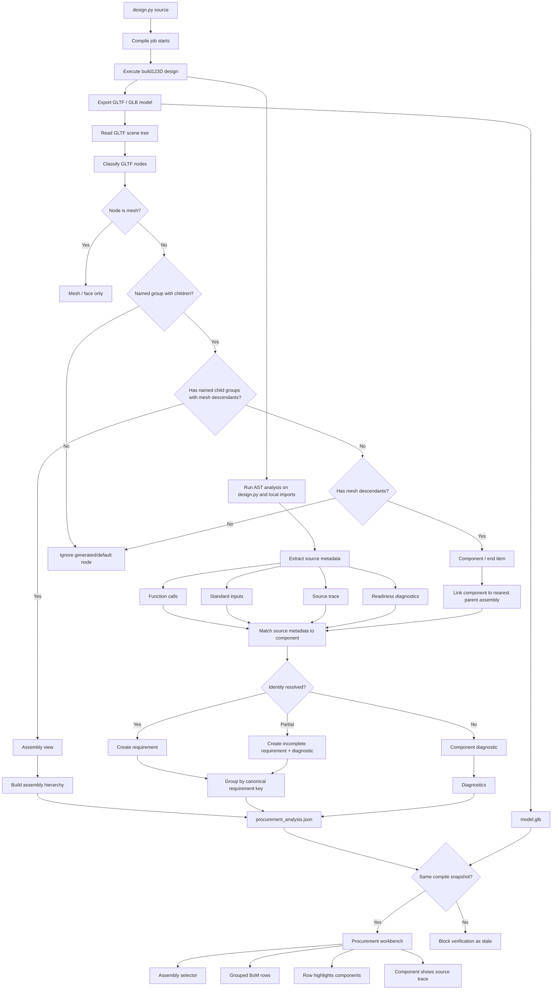
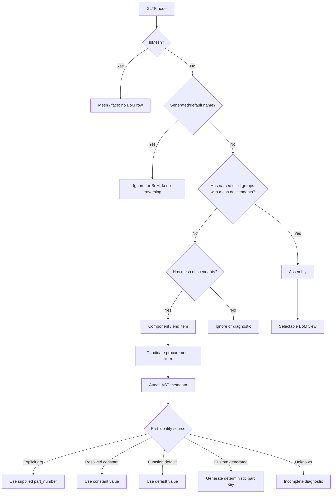

# Procurement Analysis Flow

This document describes the deterministic path for turning `design.py` plus a
GLTF scene tree into procurement data. The LLM recovery action in Procurement is
useful assistance, but it is not the primary source of truth. The primary path
should be a compile-produced procurement analysis artifact.

## Compile And Procurement Flow

## Assembly And Component Classification

## Identity Rules

The analyzer must not know product values such as `C10019`. It must derive them
from the design source.

Resolution order:

1. Explicit call argument, for example `part_number="TEST-A"`.
2. Local constant, for example `PURLIN_PART_NUMBER = "TEST-B"`.
3. Imported local constant, for example `from products import MEMBER_PART`.
4. Function default, only when the call omits the argument.
5. Deterministic generated key for custom components.
6. Diagnostic when identity is still unresolved.

Every resolved value should keep a trace with the raw expression, resolved
value, source file, source line, and resolution method.

## Test Harness

The internal package starts at `server/core/procurement_analysis`.

The initial API is:

- `analyze_design_sources(files: dict[str, str], entrypoint="design.py")`
- `analyze_gltf_tree(gltf: dict)`
- `build_procurement_analysis(source_analysis, tree_analysis, explicit_manifest=None)`

The test suite uses tiny source strings and simplified GLTF trees so it can run
without K3s, a database, LLM configuration, or executing `design.py`.

Fixture cases intentionally use names such as `TEST-A`, `TEST-B`,
`TEST-IMPORTED`, and `TEST-DEFAULT` to avoid overfitting to one shed design or
one product number.

## Current Direction

The Procurement UI can temporarily infer draft rows from live GLTF and Artus
metadata, but the production path should move this logic into compile and store
a `procurement_analysis.json` artifact beside the model artifact.
