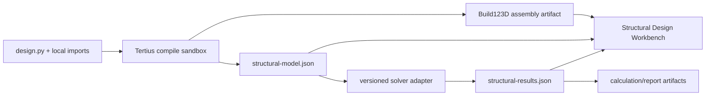

# FBD Structural Design Workbench

## Status

This is the kickoff architecture for [epic #330](https://github.com/d-b-w-gain/Tertius-Web/issues/330).
It turns the useful parts of the legacy FBD Shed Designer into a Tertius
workbench without treating the old application as the target architecture.

The immediate source is expected at
`W:\ben\ContextUI\default\workflows\shed\FBD`. The share was unavailable during
the 2026-07-27 kickoff, so the exact solver package, version, runtime files, and
legacy module split remain evidence-gathering tasks.

## Product question

The workbench must answer:

> If I change this design element, what changes in the structural model, load
> path, reactions, member checks, and order decision?

A compiled result is not trustworthy merely because it rendered or a solver
returned numbers. Every relevant design element needs a traceable chain:

`design.py input -> physical geometry -> analytical entity/load -> result -> report evidence`

Missing links are blocking diagnostics, not implied passing checks.

## What to preserve and what to leave behind

| Treatment | Legacy FBD content |
| --- | --- |
| Preserve as evidence | Representative job inputs, site/wind inputs, load cases and combinations, member checks, calculation sheets, report results, and known-good hand checks |
| Reuse behind a contract | The Python structural node/solver package, section/material data, wind calculations, load generation, result extraction, and calculation formulas |
| Re-express in Tertius | `design.py` parameters, Build123D member geometry, structural entities, stable IDs, workbench state, viewer overlays, and report artifacts |
| Do not port by default | The cube-per-element Three.js model, legacy workflow shell, duplicated UI state, generated jobs/caches, dead exporters, and modules outside the `design.py` import closure |

Files outside the import closure are not automatically junk. They are a review
queue. The safe inventory probe records them without importing or executing the
legacy project:

```powershell
uv run python scripts/spikes/structural_source_inventory.py `
  W:\ben\ContextUI\default\workflows\shed\FBD `
  --pretty
```

The JSON form records content hashes, external imports, literal runtime-file
references, module-level calls, syntax diagnostics, and Python files outside the
closure. It records no source text.

## One design state, two linked representations

The physical model and analytical model have different jobs and must not be
collapsed into one.

### Physical Build123D model

- Actual section/profile shape and dimensions.
- Member length, placement, orientation, colour, and assembly hierarchy.
- Openings, cladding, connections, and visible offsets.
- Stable component IDs for viewer selection and procurement linkage.

### Analytical structural model

- Nodes and degrees of freedom.
- Members with analytical centre-lines and local axes.
- Sections, materials, releases, supports, offsets/eccentricities, and rigid
  links.
- Nodal, member, surface, and tributary loads.
- Load cases and combinations.
- Reactions, internal actions, deflections, capacities, utilisation, warnings,
  and provenance.

Both representations reference the same stable design IDs. Build123D solids are
not used as an implicit finite-element mesh, and solver node coordinates are not
used as placeholder render geometry.

## Node placement

Nodes are authored explicitly or created by deterministic design helpers at:

- supports and restraint locations;
- physical member intersections and connection/load-transfer points;
- member ends and releases;
- section, stiffness, or orientation changes;
- point-load locations and distributed-load discontinuities;
- locations where result stations are required by a check.

Members reference their start and end nodes. Supports restrain selected degrees
of freedom at declared nodes, which is what gives reactions a defined location.
Member-end forces and internal diagrams are reported in declared local axes.

The contract must represent the difference between the analytical centre-line
and physical geometry. Offsets, eccentricities, rigid links, partial fixity, and
connection assumptions are explicit. Coincident-looking geometry does not prove
analytical connectivity.

Validation rejects or blocks:

- duplicate IDs and ambiguously coincident nodes;
- dangling, disconnected, or zero-length members;
- unsupported degrees of freedom and unstable models;
- geometry with no structural coverage when coverage is required;
- analytical members with no geometry/viewer identity;
- loads that reference missing entities or have no case/provenance;
- stale results whose source/structural hashes do not match the current compile.

## Artifact pipeline



The solver is isolated behind a versioned adapter. The compatibility spike must
first establish the exact legacy package, version, native dependencies, licence
constraints, units, sign conventions, and deterministic export behaviour. The
package should not leak its private object model into UI or persistence schemas.

## Initial artifact contracts

`structural-model.json` needs versioned collections for:

- nodes;
- members;
- sections and materials;
- supports, releases, offsets, and rigid links;
- loads, load cases, and combinations;
- geometry/source references;
- units, standards, assumptions, warnings, and provenance.

`structural-results.json` needs:

- source and structural-model hashes;
- solver identity/version and analysis settings;
- convergence/stability/equilibrium diagnostics;
- reactions and member-end forces;
- axial, shear, moment, torsion, and deflection stations;
- capacity checks, governing combinations, utilisation, and check status;
- unsupported or not-checked conditions.

Exact field names land only after the legacy inventory and minimal solver spike.

## Current-order verification gate

Before relying on the workbench for the imminent shed order, the baseline must
show where each of these appears in physical geometry, the analytical model,
loads/combinations, results, and reports:

- internal cladding self-weight;
- selected C100 batten properties, spans, spacing, restraint, and connection
  assumptions;
- revised wall positions and their load paths;
- window and door openings, jambs, headers/lintels, interrupted studs/bracing,
  and tributary loads;
- every changed connection or detail that affects stiffness, capacity,
  restraint, or load transfer;
- job-specific site and wind inputs.

The review also requires global force and moment equilibrium, reactions,
connectivity/stability, consistent units and signs, and independent comparison
with a trusted FBD result or hand calculation. Unsupported checks remain
visibly **not checked**. Tertius output alone is not engineering certification.

## Platform boundaries

- #54 remains the umbrella for Shed Designer capabilities in Tertius.
- #57 owns shared viewer/tree inspection primitives.
- #61 owns incremental component compilation and scene updates.
- #46 owns generic procurement/BoM behaviour.
- #330 owns the structural graph, solver adapter, analysis inspection, structural
  coverage, calculation evidence, and FBD reference migration.

## Open evidence questions

- What exact structural package and version does FBD import?
- Does it require native binaries, a particular Python version, or a licence?
- Which files and runtime data are in the real `design.py` closure?
- Which calculations are package-provided versus custom FBD formulas?
- What units, local-axis rules, release conventions, and load-combination rules
  are currently assumed?
- Which legacy results are trusted enough to become golden fixtures, and which
  require independent correction before migration?
